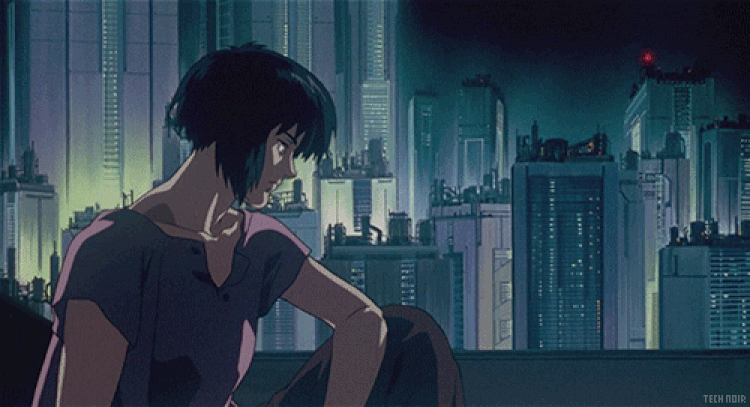

  

  
  
  
  
  
   
  
  <h1>
    Hi there
    
  </h1>

## About Me
I'm a Game Developer based in Barcelona.

## Skills
**Game Development Languages**:  
 
 

**Other Programming Languages**:  
 
 
 

**Game Engines**:  
 

**Version Control Systems**:  
 
 

**Databases**:  
 
 

**Other Tools**:  
 
 

## Connect with Me
- **Mastodon**: [@mdoradom](https://mastodon.social/@mdoradom)
- **LinkedIn**: [mdoradom](https://www.linkedin.com/in/mario-dorado-martinez/)
- **itch.io**: [mdoradom](https://mdoradom.itch.io)
- **Portfolio**: [mdoradom.com](https://mdoradom.com)
- **Blog**: [secondbrain.mdoradom.com](https://secondbrain.mdoradom.com)
