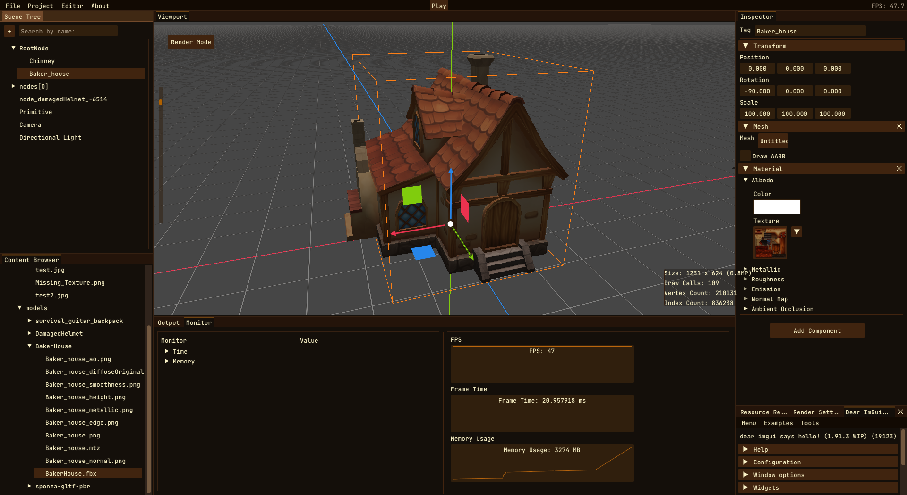

**Coffee Engine** es un pequeño motor de juegos hecho desde cero por **Hugo Planell Moreno** y **yo** como proyecto personal y académico, con el propósito de aprender en profundidad sobre cómo funcionan los motores de juegos.

Este proyecto comenzó como un experimento de verano y más tarde se convirtió en la base para el curso de *Motor de Juegos* en el **tercer año** del **Grado en Diseño y Desarrollo de Videojuegos del CITM**. El proyecto recibió una *Matrícula de Honor*, logrando una puntuación perfecta (10/10).

También fue seleccionado como el **motor oficial** para que toda la clase desarrollara un juego con **40 estudiantes** como parte de la asignatura *Proyecto 3*. El juego está actualmente en desarrollo, y una vez que se lance a finales de **Q2-2025**, actualizaré esta publicación con más información.

El proyecto es **multiplataforma**, probado en **Windows y Linux**. El soporte para macOS es posible, pero como no tenemos dispositivos Apple, no ha sido probado.

## Características

- **Multiplataforma** (Windows, Linux, macOS)
- **Editor Personalizado** con Scene Trees, Gizmos, Explorador de Contenido, panel de Salida y otros elementos de UI.
- **Sistema de Renderizado basado en PBR** con iluminación, materiales, shaders y frustum culling
- **Entity Component System** con sistema de eventos y soporte de serialización
- **Importación de Modelos 3D y Gestión de Recursos** (Assimp, sistema de registro, monitor de recursos)
- **Mouse Picking y Optimización basada en Octree**
- **Play & Stop Modes** para probar proyectos
- **Sistema de Eventos**
- **Sistema de scripting modular:** Actualmente soporta Lua, con la flexibilidad de integrar lenguajes de scripting adicionales según sea necesario.
- **Sistema de Guardar/Cargar Proyectos**
- **Documentación Extensa** (Doxygen)
- **¡y más!**

## Tecnologías Utilizadas

- **C++**
- **OpenGL**
- **Assimp**
- **EnTT**
- **GLM**
- **ImGuizmo**
- **NativeFileDialog-Extended**
- **Sol2**
- **Tracy**
- **Cereal**
- **FMT**
- **ImGui**
- **Lua**
- **SDL3**
- **SPDLOG**

## **Explora el Proyecto**

Puedes encontrar más información sobre el proyecto en varias plataformas:

- [**Repositorio de GitHub**](https://github.com/Brewing-Team/Coffee-Engine): Ver el código fuente y el progreso del desarrollo.
- [**Sitio Web de Documentación**](https://brewing-team.github.io/Coffee-Engine/): Explora la documentación oficial.

**¡Gracias por explorar Coffee Engine!**
