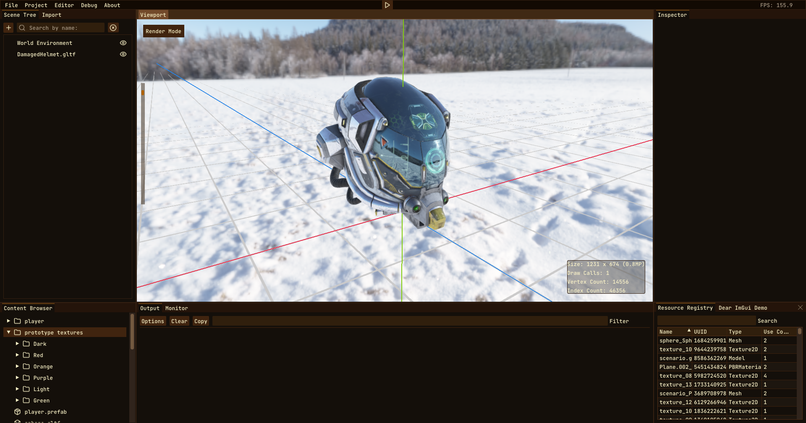

**Coffee Engine** es un motor de juegos hecho desde cero por **Hugo Planell Moreno** y **yo** como proyecto personal y académico, con el propósito de aprender en profundidad sobre cómo funcionan los motores de juegos.

Este proyecto comenzó como un experimento de verano y más tarde se convirtió en la base para la asignatura de *Motores de Juegos* en el **tercer año** del **Grado en Diseño y Desarrollo de Videojuegos del CITM**. El proyecto recibió una *Matrícula de Honor*, consiguiendo una puntuación perfecta (10/10).

También fue seleccionado como el **motor oficial** para que toda la clase desarrollara un juego con **40 estudiantes** como parte de la asignatura *Proyecto 3*. Para saber más sobre este proyecto puedes leer mi post sobre [Warhammer 40.000: The Last Marine](/projects/w40k-tlm/) aquí.

## Características

### **Architecture**
- **CoffeeEngine Core Library**: Arquitectura modular
- **CoffeeEditor**: Editor completo
- **Cross-Platform Support**: Soporte para Windows y Linux

### **Rendering**

#### **3D Rendering**
- **Forward Rendering Pipeline**: Implementación moderna
- **PBR Materials**: Pipeline PBR
- **Shader Materials**: Soporte para sjaders custom
- **Textures**: Sistema de cargar y gestión de texturas
- **Skybox**: Mapeado de entorno HDR
- **HDR Rendering**: Pipeline de alto rango dinámico

#### **Post-Processing**
- **FXAA**: Implementación de Fast Approximate Antialiasing
- **Bloom**: Bloom basado en física
- **Fog**: Depth Fog
- **Tone Mapping**: AgX tone mapping

#### **Lighting & Shadows**
- **Directional Lights**: Luz direcciónal / sol con sombras
- **Point Lights (Omni)**: fuentes de luz 360 grados
- **Spot Lights**: Iluminación direccional en forma de cono
- **Directional Shadows**: Mapeo de sombras en tiempo real
- **Image-Based Lighting (IBL)**: Iluminación ambiental
- **Frustum Culling**: Optimización basada en octree

#### **2D Rendering**
- **Renderer2D**: Renderizado optimizado de sprites 2D
- **2D Batching**: Optimización automática de draw calls

### **Game Systems**

#### **Entity Component System (ECS)**
- **EnTT Integration**: Gestión de entidades eficiente
- **Scene Tree**: Organización jerárquica de escenas
- **Component System**: Composición modular de objetos de juego
- **Model Loading**: Importación y gestión de recursos 3D

#### **Animation System**
- **3D Skeletal Animation**: Animación de personajes basada en huesos
- **Animation Blending**: Transiciones suaves entre estados
- **Partial Animation Blending**: Animación de partes del cuerpo por capas

#### **Prefab System**
- **Reusable Templates**: Plantillas de objetos basadas en componentes
- **Hierarchy Preservation**: Relaciones padre-hijo
- **Cross-Component References**: Integridad automática de referencias
- **Human-Readable Serialization**: Formato `.prefab` con control de versiones
- **Runtime Instantiation**: Creación dinámica de prefabs

### **Audio**
- **Wwise Integration**: Middleware profesional de audio
- **3D Spatial Audio**: Audio posicional con atenuación por distancia
- **RTPCs**: Controles de parámetros en tiempo real
- **Audio Banks & Events**: Gestión organizada de recursos de audio
- **Auxiliary Sends**: Enrutamiento de audio definido por el juego

### **Navigation**
- **Pathfinding System**: Navegación IA con evitación de obstáculos
- **Navmesh Generation**: Creación automática de mallas de navegación

### **Physics**
- **Bullet Physics Integration**: Simulación de físicas
- **Rigid Body System**: Cuerpos estáticos, dinámicos y cinemáticos
- **Collision Detection**: Eventos de entrada/permanencia/salida con manifolds
- **Multiple Collider Types**: Caja, Esfera, Cápsula, Cilindro, Cono
- **Raycasting API**: Detección de impacto simple/múltiple
- **Physics Debugging**: Visualización de formas de colisión y debug de raycast

### **Scripting**
- **Lua Integration**: Interoperabilidad C++/Lua potenciada por Sol2
- **Advanced Bindings**: Conversiones automáticas de tipos y manejo de errores
- **IntelliSense Support**: Archivos stub generados automáticamente
- **Language-Agnostic Design**: Extensible para lenguajes adicionales
- **Entity Integration**: Vinculación directa de scripts a objetos de juego

### **Development Tools**

#### **Resource Management**
- **Asset Pipeline**: Importación y procesamiento automático
- **Resource Caching**: Carga inteligente de assets
- **Hot Reloading**: Actualizaciones de recursos en tiempo real

#### **Editor Features**
- **Scene Hierarchy**: Gestión visual del grafo de la escena
- **Component Inspectors**: Edición de propiedades en tiempo real
- **Asset Browser**: Interfaz de gestión de recursos
- **Viewport**: Visualización de escena 3D

#### **Profiling & Debugging**
- **Tracy Integration**: Profiling de rendimiento en tiempo real
- **Debug Rendering**: Sistemas visuales de depuración
- **Console & Logging**: Herramientas integradas de depuración

#### **Serialization & Persistence**
- **Scene Serialization**: Sistema completo de guardado/carga de escenas
- **Cereal Library**: Serialización robusta con versiones

## Tecnologías Utilizadas

- **C++**
- **OpenGL**
- **Assimp**
- **EnTT**
- **GLM**
- **ImGuizmo**
- **NativeFileDialog-Extended**
- **Sol2**
- **Tracy**
- **Cereal**
- **FMT**
- **ImGui**
- **Lua**
- **SDL3**
- **SPDLOG**
- **Bullet3**
- **Wwise**

## **Explora el Proyecto**

Puedes encontrar más información sobre el proyecto en varias plataformas:

- [**Repositorio de GitHub**](https://github.com/Brewing-Team/Coffee-Engine): Ver el código fuente y el progreso del desarrollo.
- [**Sitio Web de Documentación**](https://brewing-team.github.io/Coffee-Engine/): Explora la documentación oficial.

**¡Gracias por explorar Coffee Engine!**
