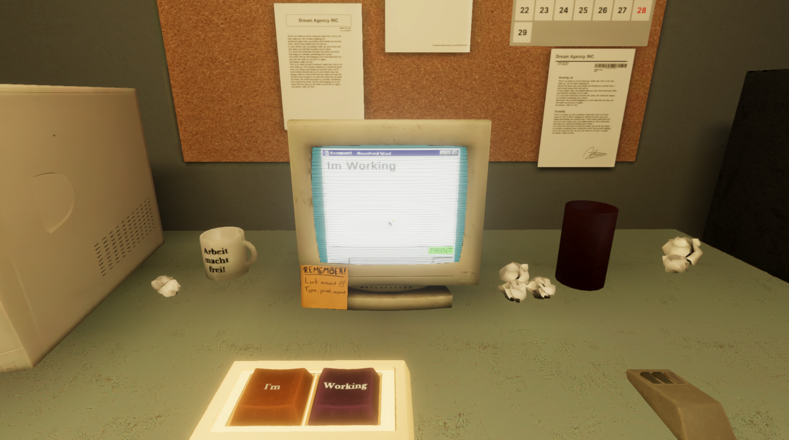
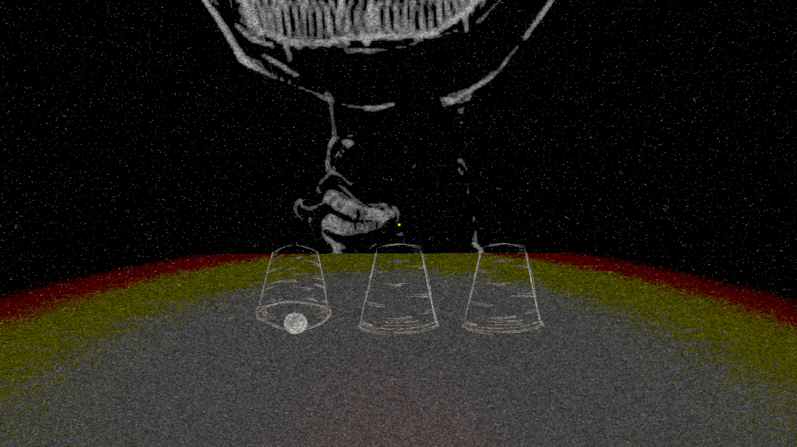

**Karoshi Dreams** is a game developed for the **7th Gran CITM Game Jam**, organized by **CITM UPC** with collaboration from **GAMELOFT** and **SOCIAL POINT** as judges. The game was created in just **5 days**, exploring the Japanese term "**karoshi**" (death by overwork) within a **surrealistic and dark atmosphere**. The main theme of the jam was **dreams and nightmares**.

### Technologies Used

- Unity
- C#
- Blender

### Explore the project:

You can find more about the project on various platforms:

- [**GitHub Repository**](https://github.com/Very-Serious-Games/Karoshi-Dreams): View the source code and development progress.
- [**Itch.io**](https://mdoradom.itch.io/karoshidreams): Play the game and leave feedback.
- [**7th Gran CITM Game Jam**](https://itch.io/jam/7a-gran-citm-game-jam/): Learn more about the event where the game was developed.

**Thank you for exploring Karoshi Dreams!**
