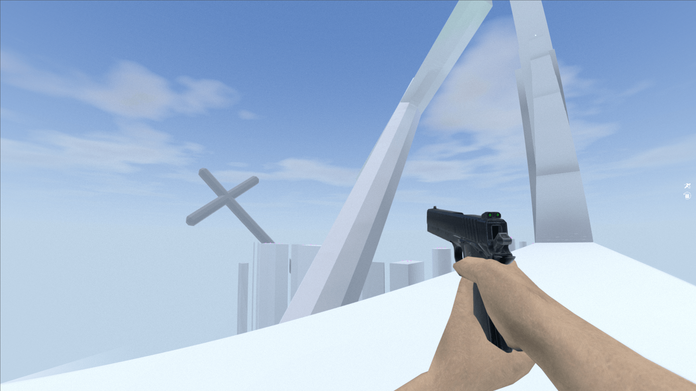
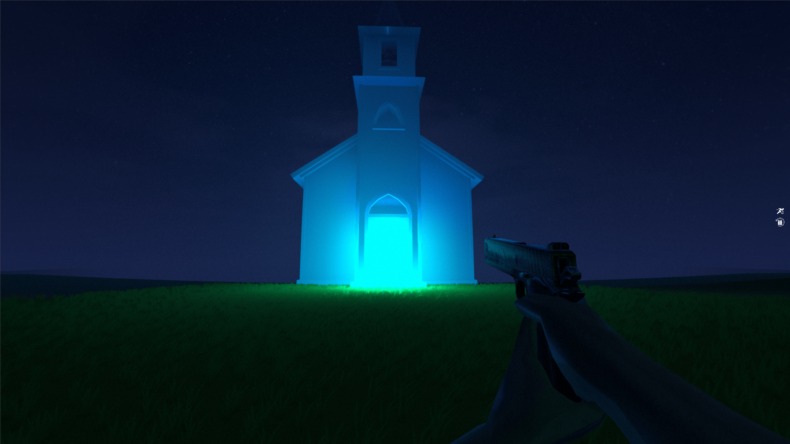
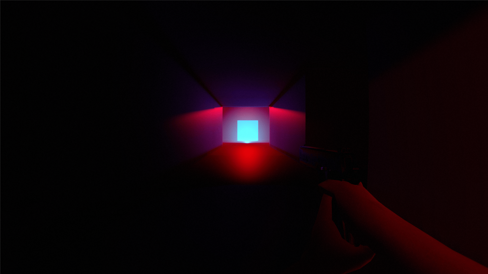

**Mindfall - The Last Threshold** es un shooter psicológico en primera persona desarrollado para la **8ª Gran CITM Game Jam**, organizada por **CITM UPC** en colaboración con **GAMELOFT**, **SOCIAL POINT**, **Larian Studios**, **Donestech** y el **Ayuntamiento de Terrassa** como jueces. El juego fue creado en solo **7 días**, llevando al límite nuestra capacidad para crear una jugabilidad FPS rápida con una buena narrativa atmosférica.

### Historia y Atmósfera

El juego sigue el viaje de un protagonista que, luchando contra la depresión, intenta quitarse la vida. Sin embargo, en lugar de un final abrupto, se encuentra atrapado en las profundidades de su subconsciente. Los jugadores navegan por entornos surrealistas y caóticos que representan fragmentos del pasado del protagonista, donde deben enfrentarse a sus miedos y ansiedades.

- **Un shooter FPS de ritmo rápido** con movimientos precisos y combate intenso.
- **Un enfoque visual único**: Texturas minimalistas con un fuerte énfasis en la iluminación y efectos de post-procesado para mejorar la atmósfera inquietante.
- **Encuentros con enemigos** que obligan a los jugadores a adaptarse y luchar contra manifestaciones de los miedos del protagonista.
- **Una atmósfera profunda y opresiva** que cambia conforme los jugadores avanzan, creando una sensación de inquietud y urgencia.

### Tecnologías Utilizadas

- **Godot**
- **Blender**
- **GDScript**

### Mi Rol en el Desarrollo

Fui el único programador en este proyecto, encargándome de todos los aspectos relacionados con el **motor**, incluyendo:
- **Mecánicas de juego**
- **Sistemas de combate**
- **Efectos de iluminación y post-procesado**
- **Optimización y depuración**

### Explora el proyecto:

Puedes encontrar más información sobre el proyecto en varias plataformas:

- [**Repositorio de GitHub**](https://github.com/Very-Serious-Games/Mindfall): Ver el código fuente y el progreso del desarrollo.
- [**Itch.io**](https://mdoradom.itch.io/mindfall): Jugar al juego y dejar comentarios.
- [**8ª Gran CITM Game Jam**](https://itch.io/jam/8a-gran-citm-game-jam/): Conocer más sobre el evento donde se desarrolló el juego.

**¡Gracias por explorar Mindfall!**