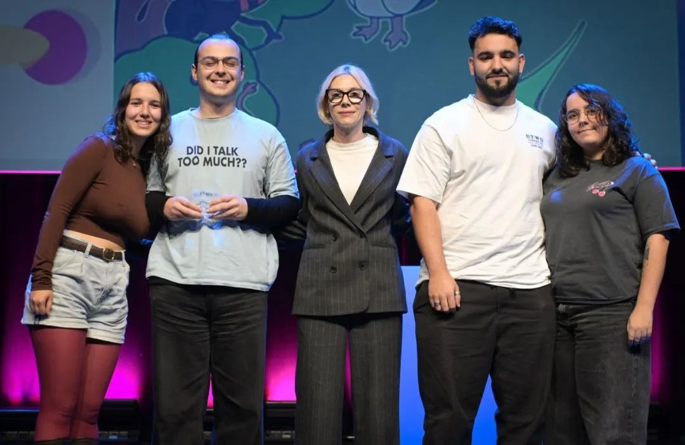
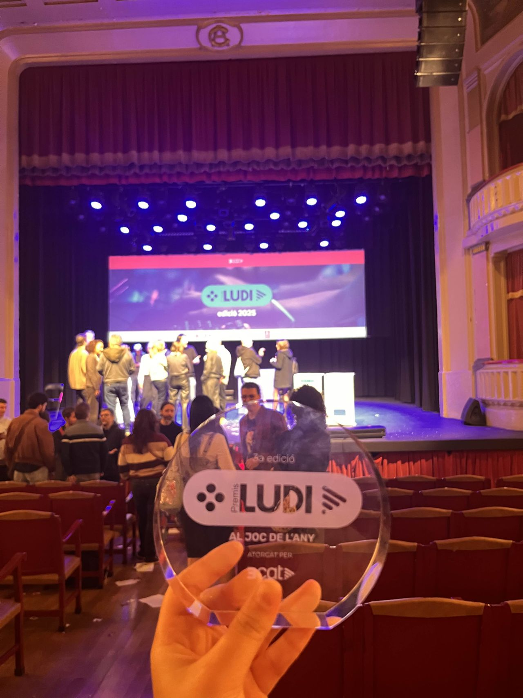
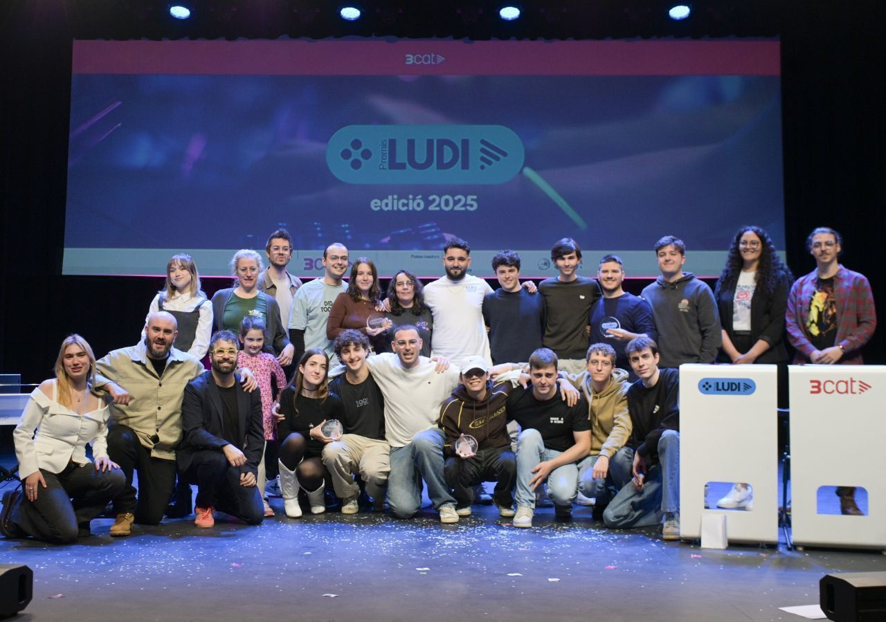

**Paraulina** is an educational and exploration adventure designed to foster oral comprehension and spelling in Catalan for children in **2nd grade (6 to 8 years old)**.

The project was developed by a team of 4 students: **Marta Jover Valero**, **Hugo Planell Moreno**, **Alba Silvente Izquierdo**, and myself, for the 3rd edition of **Premis Ludi**. This contest, powered by **3Cat**, is supported by industry giants such as **Larian Studios**, **Abylight Studios**, and **Gameloft**. After competing against more than 160 developers and 50 prototypes, Paraulina won the **Game of the Year** award, guaranteeing its professional production and official publication.

<iframe width="560" height="315" src="https://www.youtube.com/embed/_LMUdNbnZak" title="YouTube video player" frameborder="0" allow="accelerometer; autoplay; clipboard-write; encrypted-media; gyroscope; picture-in-picture; web-share" referrerpolicy="strict-origin-when-cross-origin" allowfullscreen></iframe>

In the presented prototype, we developed the **first complete level**: *"Animals living in Catalonia"*. The player explores a natural environment where they must rescue local fauna, from the *trencalòs* (bearded vulture) to the *escurçó* (viper), while learning about them.

The game design prioritizes **accessibility** and **scalability**: it uses rounded shapes and features a **dyslexia mode** which uses the *OpenDyslexic* font to ensure readability. Furthermore, the game's architecture was designed modularly to adapt the content to **any future curricular subject** (Geography, Recycling, Human Body, etc.) without changing the base code.

### Game Pillars

The game loop fuses curricular learning with the fun of completing a sticker album:

- **Listen!** The narrative is guided by audio. At the start, a dictation indicates the names of the animals to find, working on auditory comprehension.
- **Break!** Interact with the environment by "double-clicking" on objects (clouds, stones, feathers) to release the letters hiding inside.
- **Form!** Drag the letters to build words. We implemented a **magnetism** effect and **wooden piece** sounds to give the UI a tactile and organic feel.
- **Collect & Manage!** Each correct word grants a **sticker** and **gomets**. These rewards are stored in an **interactive album**, where players can view their progress and manage their collections.

### Technologies Used

- **Godot 4**
- **GDScript**
- **Git**
- **Penpot**

### Explore the project:

You can find more details about the development and the award at the following links:

- [**Play on Itch.io**](https://mdoradom.itch.io/paraulina): Play the winning prototype directly in your browser or download the build.
- [**Project Repository**](https://github.com/mdoradom/ludis_2025): Source code of the prototype presented at the contest.
- [**Official 3Cat News**](https://www.3cat.cat/3catinfo/els-premis-ludi-impulsats-per-3cat-guardonen-quatre-prototips-de-videojoc-educatiu-per-a-infants/noticia/3379950/): Event coverage and details about the "Game of the Year" award.
- [**Premis Ludi**](https://premisludi.cat/): Official contest website.
- [**Trailer**](https://www.youtube.com/watch?v=_LMUdNbnZak): Promotional video of the game.
- [**GDD (Documentation)**](https://github.com/mdoradom/ludis_2025/blob/main/docs/Paraulina_Documentation.pdf): Game Design Document detailing mechanics, art, and scalability.

**Thank you for exploring Paraulina!**