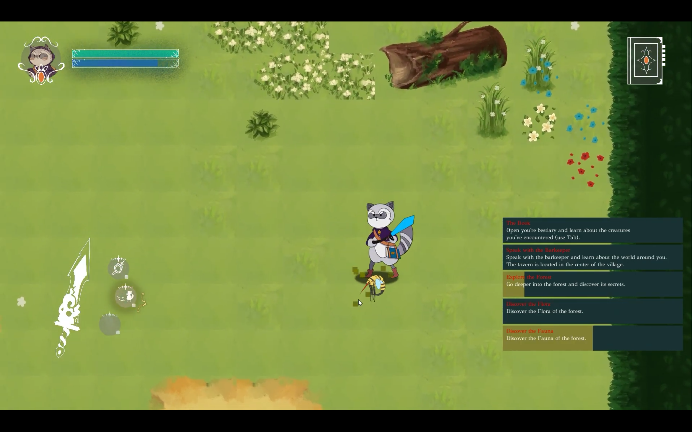
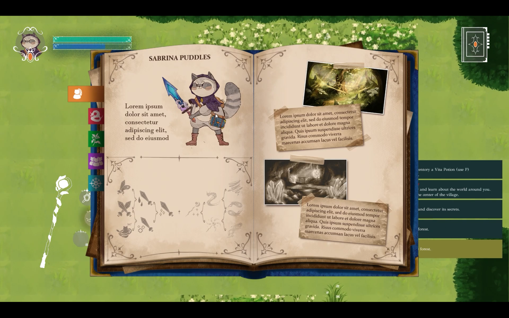
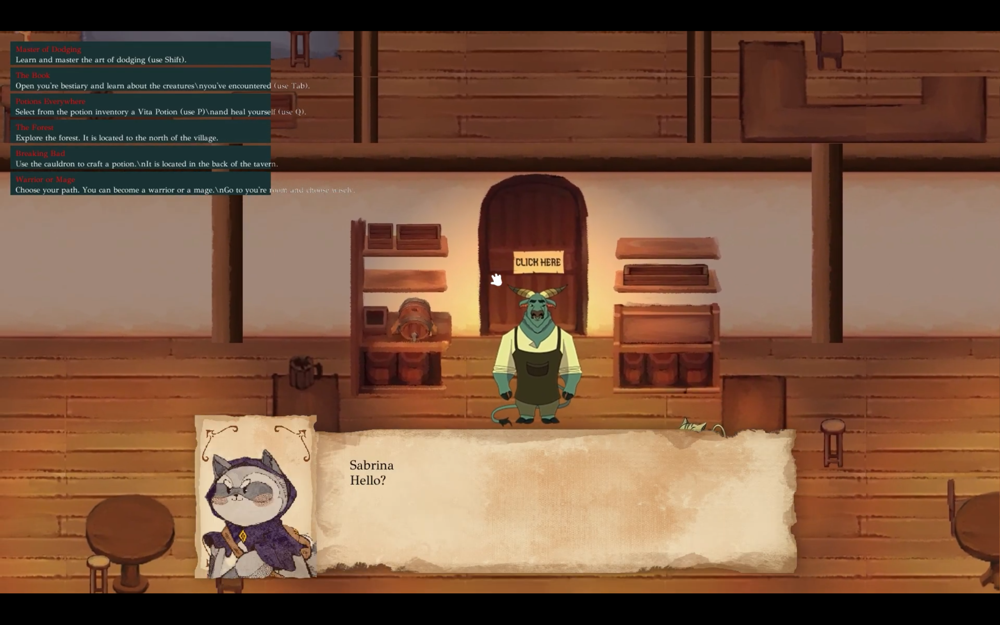

**Puddle's Legacy** is a single-player real-time action role-playing game (RPG) set in a fantasy world. Sabrina must follow the footsteps of her missing father to fill a magical book of beasts by exploring very dangerous terrain. Will Sabrina manage to find her father in this adventure?

The game was developed for the **Project 2 course** as a collaboration between the **Design and Development of Video Games degree** and the **Design, Animation, and Digital Art degree**. Our team consisted of 10 developers from the video game degree handling the technical aspects, and 8 artists from the art degree responsible for the artistic aspects of the game like concepts, sprites, or animations.

I worked alongside my teammate, **Hugo Planell Moreno**, in the role of **Tech Team Leader and Programmer**. We were responsible for organizing the team, integrating changes, and managing the implementation of features by all 18 team members. The game was developed over a period of **4 months**.

### Technologies Used

- C++
- SDL2

### Explore the project:

Puedes encontrar más información sobre el proyecto en varias plataformas:

- [GitHub Repository](https://github.com/Pistachio-Studios/Puddles-Legacy): View the source code and development progress.
- [Website](https://pistachio-studios.github.io/Puddles-Legacy/): Find additional resources like the artbook or the trailer.
- [Itch.io](https://martagnarta.itch.io/puddles-legacy): Enjoy the game and leave feedback.

**Thank you for exploring Puddle's Legacy!**