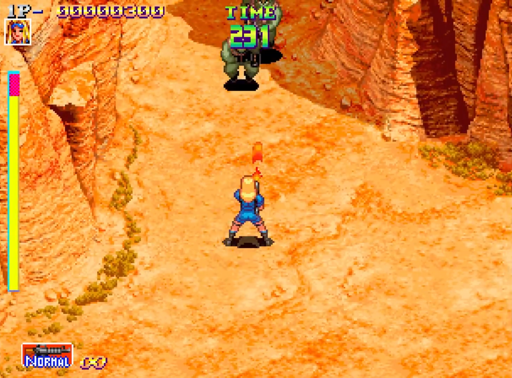
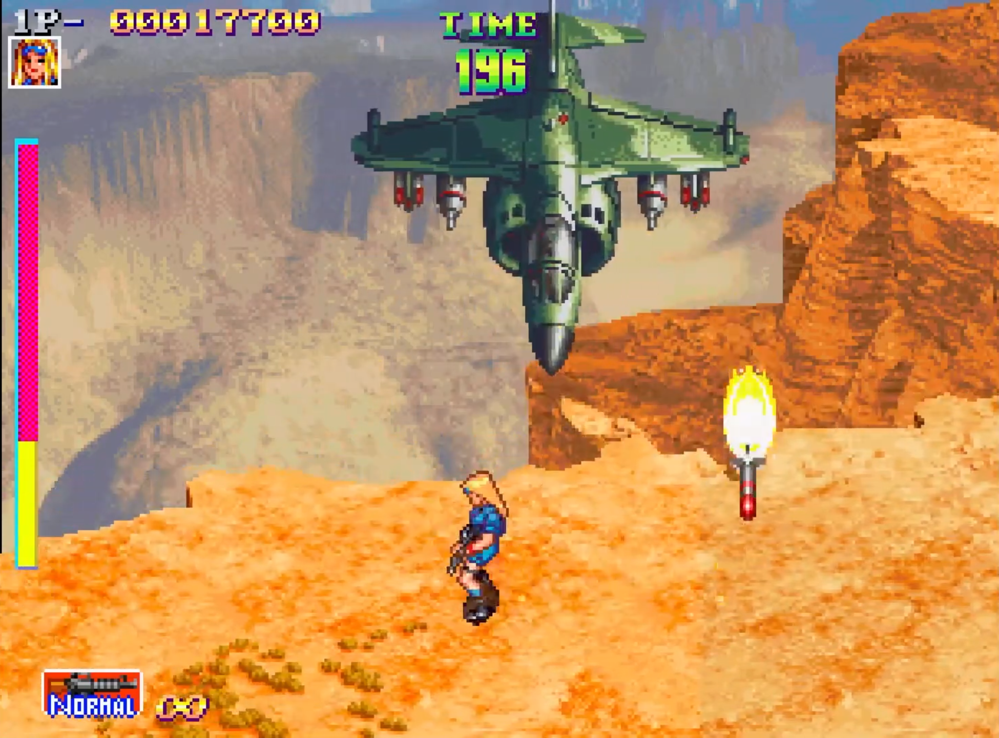
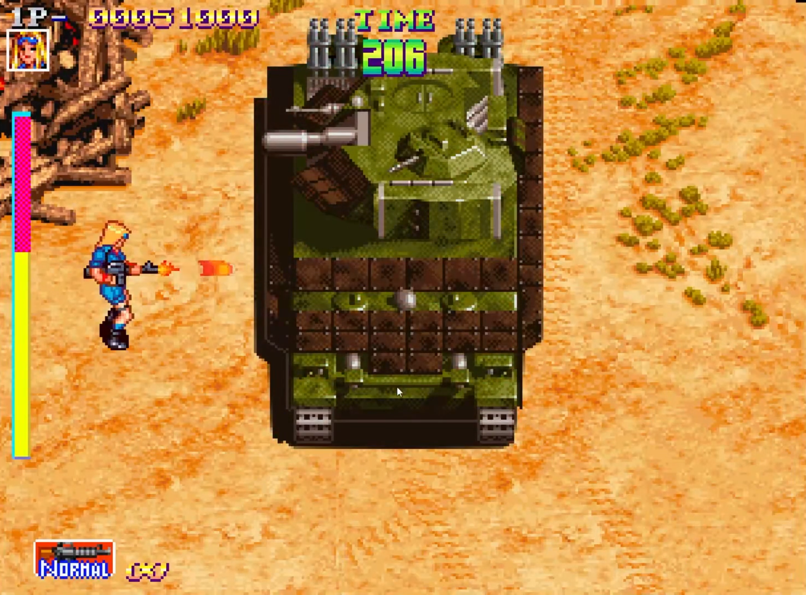

This project was developed for the **Project 1 course** during my first year of college. The goal was to recreate the game **Shock Troopers** within **4 months** using our own game engine, utilizing **C++** and **SDL2**.

### Technologies Used

- **C++**
- **SDL2**

### Explore the project:

You can find more about the project on various platforms:

- [**GitHub Repository**](https://github.com/Very-Serious-Games/Project1-Shock-Troopers): View the source code and development progress.
- [**Website**](https://very-serious-games.github.io/Project1-Shock-Troopers/): Learn more about the game and its features.
- [**Wiki**](https://github.com/Very-Serious-Games/Project1-Shock-Troopers/wiki): Find detailed documentation and guides.
- [**GitHub Release**](https://github.com/Very-Serious-Games/Project1-Shock-Troopers/releases/tag/Release): Play the game and explore its releases.

**Thank you for exploring Shock Troopers!**
