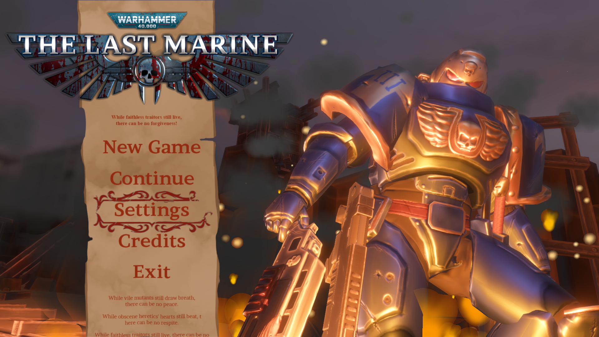
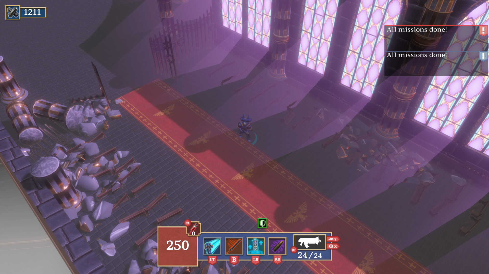

**Warhammer 40.000: The Last marine** és un videojoc de trets isomètric amb pilars centrats en l'exploració i l'acció. Va ser desenvolupat per un equip de 40 alumnes del **CITM-UPC** durant l'assignatura de **Projecte 3**, en un temps rècord de **4 mesos**, utilitzant el nostre propi motor de joc: [**Coffee Engine**](/projects/coffee-engine/index.es.md), escrit en **C++** i **OpenGL**.

> *Only one Ultramarine survived the drop – Battle-Brother Quintus Maxillian. Alone. Outnumbered. Unbreakable.*

<iframe width="560" height="315" src="https://www.youtube.com/embed/pNp_OPTwnTo?si=zX3H7H6xo-4vuOib" title="YouTube video player" frameborder="0" allow="accelerometer; autoplay; clipboard-write; encrypted-media; gyroscope; picture-in-picture; web-share" referrerpolicy="strict-origin-when-cross-origin" allowfullscreen></iframe>

Prens el paper de l'**últim Marine Espacial**, enfrontant-te a hordes d'enemics en un planeta en guerra. Amb controls accessibles i una jugabilitat frenètica, el joc ofereix una experiència intensa des del primer segon.

### Pilars del joc

- **Exploració del món**  
    Recorre entorns diversos i descobreix secrets ocults en un planeta devastat per la guerra.

- **Combat ràpid i visceral**  
    Lluita en enfrontaments plens d'adrenalina, utilitzant tot el teu arsenal.

- **Accessibilitat**  
    Mecàniques intuïtives que permeten entrar en acció ràpidament, però amb profunditat tàctica per a jugadors experimentats.

### La meva contribució

Abans de començar aquest projecte, ja estava treballant en el desenvolupament del [**Coffee Engine**](/projects/coffee-engine/index.es.md). Durant el desenvolupament de *The Last Marine*, la meva responsabilitat principal va ser expandir i mantenir el motor, afegint sistemes clau per facilitar la producció del joc. Les meves tasques van incloure:

- Desenvolupament del **mòdul de físiques**
- Implementació del **sistema de detecció de col·lisions**
- Desenvolupament del **sistema de prefabs**
- Desenvolupament del **sistema de scripting amb Lua**
- Implementació del **frustum culling estàtic amb octrees**
- Revisió de *pull requests* per mantenir la qualitat del codi
- Optimització de rendiment mitjançant eines de *profiling*
- Manteniment de les **builds per a Linux**, incloent compatibilitat amb **Steam Deck** (rendiment, suport de controladors, etc.)
- Documentació tècnica del motor

### Tecnologies utilitzades

- **C++**
- **Lua**
- **Coffee Engine**
- **Tracy**

### Explora el projecte:

Pots trobar més sobre el projecte a diverses plataformes:

- [**Descarrega W40K: TLM**](https://burned-games.github.io/downloads): Descarrega Warhammer 40.000: The Last Marine tant per a Windows com Linux!
- [**Repositori del joc**](https://github.com/Burned-Games/W40K-TLM): Codi font complet de *The Last Marine*.
- [**Repositori del motor**](https://github.com/Burned-Games/Coffee-Engine): Motor de joc.
- [**Documentació del motor**](https://burned-games.github.io/Coffee-Engine/): Documentació tècnica del motor i guies.
- [**Pàgina web de Burned Games**](https://burned-games.github.io/): Informació de l'equip i el projecte.
- [**Organització a GitHub**](https://github.com/Burned-Games): Tots els repositoris relacionats.
- [**Tràiler**](https://www.youtube.com/watch?v=pNp_OPTwnTo): Tràiler del joc.

**Gràcies per explorar Warhammer 40.000: The Last Marine!**

