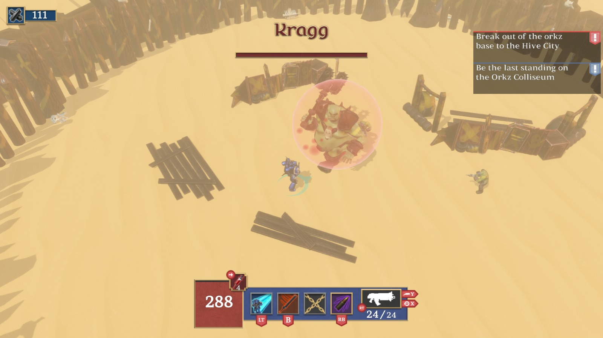

**Warhammer 40.000: The Last Marine** es un videojuego de disparos isométrico con pilares centrados en la exploración y la acción. Fue desarrollado por un equipo de 40 alumnos de **CITM-UPC** durante la asignatura de **Proyecto 3**, en un tiempo récord de **4 meses**, utilizando nuestro propio motor de juego: [**Coffee Engine**](/projects/coffee-engine/index.es.md), escrito en **C++** y **OpenGL**.

> *Only one Ultramarine survived the drop – Battle-Brother Quintus Maxillian. Alone. Outnumbered. Unbreakable.*

<iframe width="560" height="315" src="https://www.youtube.com/embed/pNp_OPTwnTo?si=zX3H7H6xo-4vuOib" title="YouTube video player" frameborder="0" allow="accelerometer; autoplay; clipboard-write; encrypted-media; gyroscope; picture-in-picture; web-share" referrerpolicy="strict-origin-when-cross-origin" allowfullscreen></iframe>

Tomas el papel del **último Marine Espacial**, enfrentándote a hordas de enemigos en un planeta en guerra. Con controles accesibles y una jugabilidad frenética, el juego ofrece una experiencia intensa desde el primer segundo.

### Game Pillars

- **Exploración del mundo**  
  Recorre entornos diversos y descubre secretos ocultos en un planeta devastado por la guerra.

- **Combate rápido y visceral**  
  Lucha en enfrentamientos cargados de adrenalina, utilizando todo tu arsenal.

- **Accesibilidad**  
  Mecánicas intuitivas que permiten entrar en acción rápidamente, pero con profundidad táctica para jugadores experimentados.

### Mi contribución

Antes de comenzar este proyecto, ya estaba trabajando en el desarrollo del [**Coffee Engine**](/projects/coffee-engine/index.es.md). Durante el desarrollo de *The Last Marine*, mi responsabilidad principal fue expandir y mantener el motor, añadiendo sistemas clave para facilitar la producción del juego. Mis tareas incluyeron:

- Desarrollo del **módulo de físicas**
- Implementación del **sistema de detección de colisiones**
- Desarrollo del **sistema de prefabs**
- Desarrollo del **sistema de scripting con Lua**
- Implementación del **frustum culling estático con octrees**
- Revisión de *pull requests* para mantener la calidad del código
- Optimización de rendimiento mediante herramientas de *profiling*
- Mantenimiento de las **builds para Linux**, incluyendo compatibilidad con **Steam Deck** (rendimiento, soporte de controladores, etc.)
- Documentación técnica del motor

### Tecnologías utilizadas

- **C++**
- **Lua**
- **Coffee Engine**
- **Tracy**

### Explora el proyecto:

Puedes encontrar más sobre el proyecto en varias plataformas:

- [**Descarga W40K: TLM**](https://burned-games.github.io/downloads): Descarga Warhammer 40.000: The Last Marine tanto en Windows como Linux!
- [**Repositorio del juego**](https://github.com/Burned-Games/W40K-TLM): Código fuente completo de *The Last Marine*.
- [**Repositorio del motor**](https://github.com/Burned-Games/Coffee-Engine): Motor de juego.
- [**Documentación del motor**](https://burned-games.github.io/Coffee-Engine/): Documentación técnica del motor y guías.
- [**Página web de Burned Games**](https://burned-games.github.io/): Información del equipo y el proyecto.
- [**Organización en GitHub**](https://github.com/Burned-Games): Todos los repositorios relacionados.
- [**Trailer**](https://www.youtube.com/watch?v=pNp_OPTwnTo): Trailer del juego.

**¡Gracias por explorar Warhammer 40.000: The Last Marine!**
