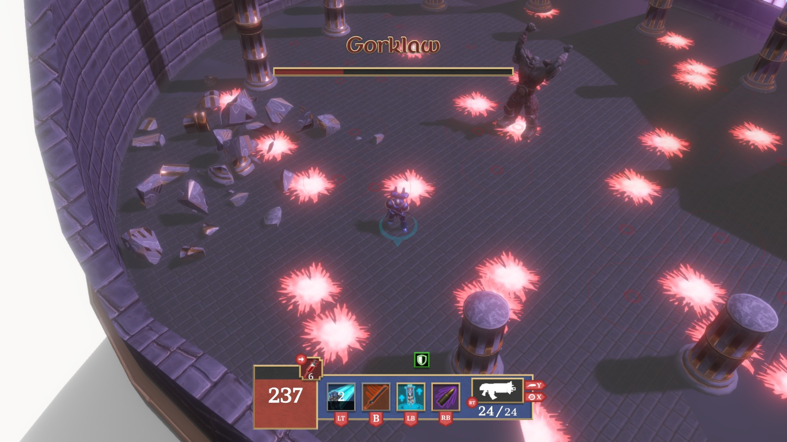

**Warhammer 40,000: The Last Marine** is an isometric shooter focused on exploration and action. It was developed by a team of 40 students from **CITM-UPC** during the **Project 3** course, in a record time of **4 months**, using our own game engine: [**Coffee Engine**](/projects/coffee-engine/), written in **C++** and **OpenGL**.

> *Only one Ultramarine survived the drop – Battle-Brother Quintus Maxillian. Alone. Outnumbered. Unbreakable.*

<iframe width="560" height="315" src="https://www.youtube.com/embed/pNp_OPTwnTo?si=zX3H7H6xo-4vuOib" title="YouTube video player" frameborder="0" allow="accelerometer; autoplay; clipboard-write; encrypted-media; gyroscope; picture-in-picture; web-share" referrerpolicy="strict-origin-when-cross-origin" allowfullscreen></iframe>

You play as the **last Space Marine**, facing hordes of enemies on a war-torn planet. With accessible controls and frantic gameplay, the game offers an intense experience from the very first second.

### Game Pillars

- **World Exploration**  
    Traverse diverse environments and uncover hidden secrets on a planet ravaged by war.

- **Fast and visceral combat**  
    Engage in adrenaline-fueled battles using your entire arsenal.

- **Accessibility**  
    Intuitive mechanics let you jump into the action quickly, with tactical depth for experienced players.

### My Contribution

Before starting this project, I was already working on the development of the [**Coffee Engine**](/projects/coffee-engine/). During the development of *The Last Marine*, my main responsibility was to expand and maintain the engine, adding key systems to facilitate game production. My tasks included:

- Development of the **physics module**
- Implementation of the **collision detection system**
- Development of the **prefab system**
- Development of the **Lua scripting system**
- Implementation of **static frustum culling with octrees**
- Reviewing *pull requests* to maintain code quality
- Performance optimization using *profiling* tools
- Maintenance of **Linux builds**, including compatibility with **Steam Deck** (performance, controller support, etc.)
- Technical documentation for the engine

### Technologies Used

- **C++**
- **Lua**
- **Coffee Engine**
- **Tracy**

### Explore the Project:

You can find out more about the project on several platforms:

- [**Download W40K: TLM**](https://burned-games.github.io/downloads): Download Warhammer 40,000: The Last Marine for both Windows and Linux!
- [**Game repository**](https://github.com/Burned-Games/W40K-TLM): Complete source code of *The Last Marine*.
- [**Engine repository**](https://github.com/Burned-Games/Coffee-Engine): Game engine.
- [**Engine documentation**](https://burned-games.github.io/Coffee-Engine/): Technical documentation and guides for the engine.
- [**Burned Games website**](https://burned-games.github.io/): Team and project information.
- [**GitHub organization**](https://github.com/Burned-Games): All related repositories.
- [**Trailer**](https://www.youtube.com/watch?v=pNp_OPTwnTo): Game trailer.

**Thank you for exploring Warhammer 40,000: The Last Marine!**

